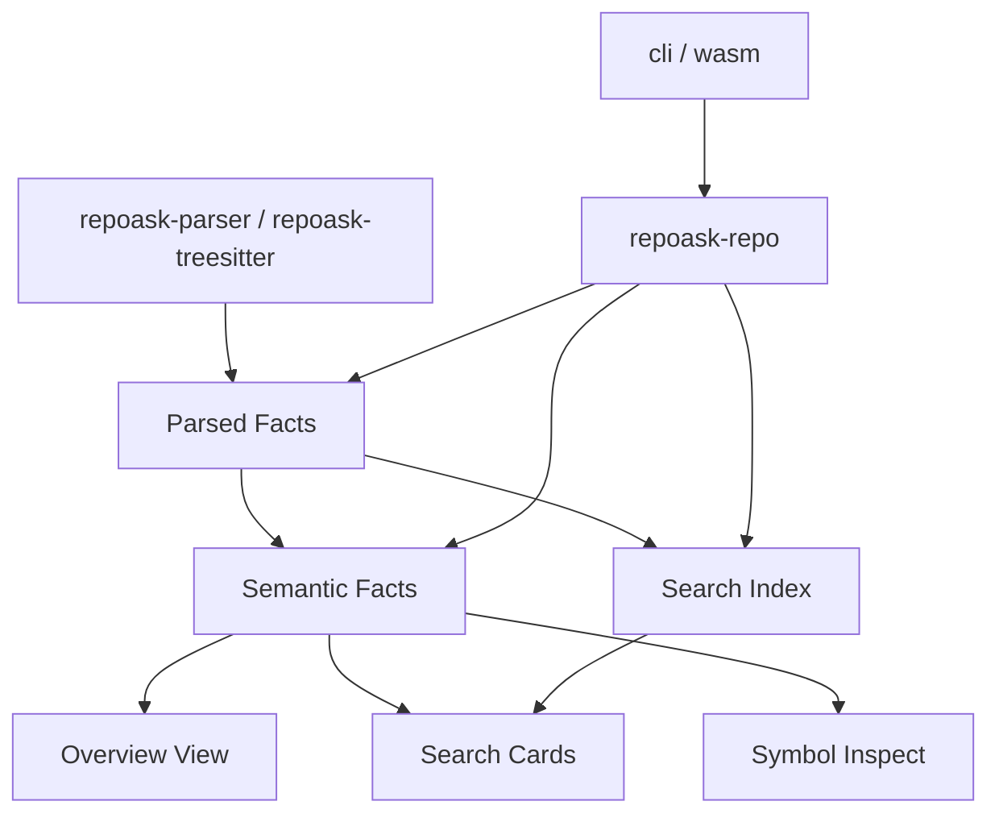
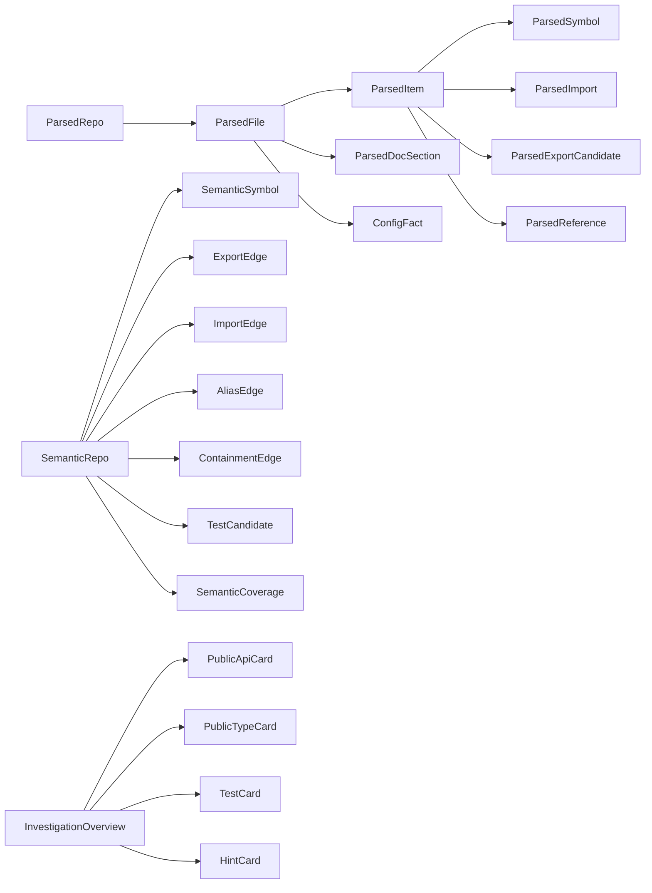
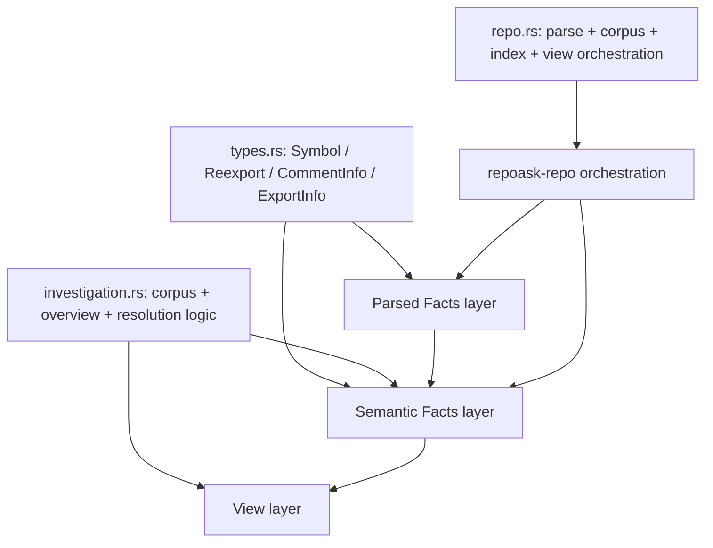
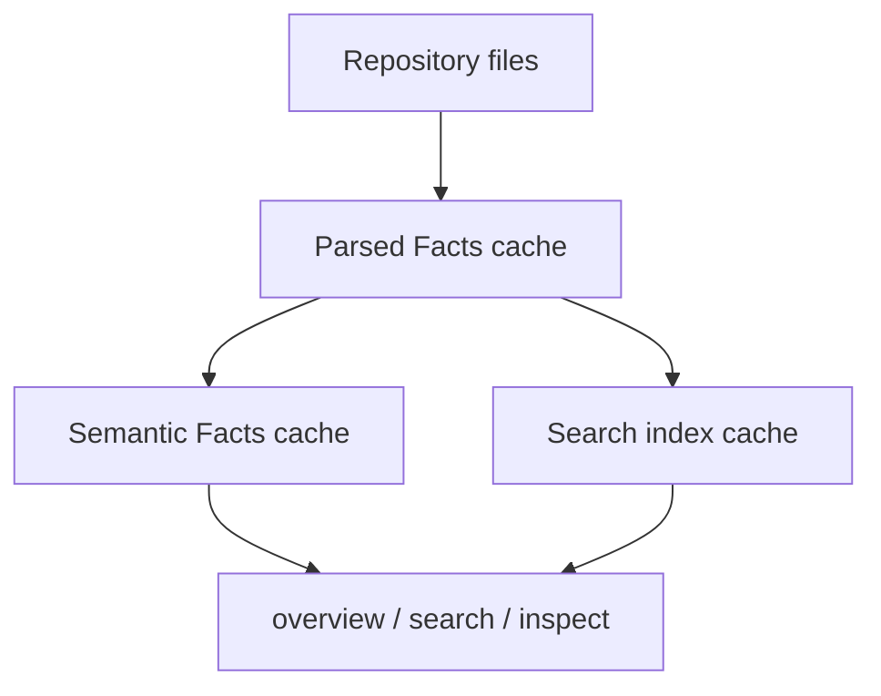

# refactor: Introduce program facts architecture

## Overview

Replace the current `overview`-driven investigation model with a reusable program-facts architecture that can support `overview`, `search`, and future `inspect` without repeated parser-shape churn.

The redesign is intentionally breaking. The goal is to accept one large migration now so future use-case expansion does not keep forcing destructive model changes, wide verification passes, and ad hoc metadata growth.

This plan treats the current `overview` implementation as proof of value, but not as the final architectural center.

## Problem Frame

The current implementation proved that public-surface-first investigation is valuable, but it also exposed a structural problem: parser facts, language-specific semantics, and `overview` view concerns are mixed together.

That coupling is already visible in the current code:

- `Symbol`, `Reexport`, `CommentInfo`, and `ExportInfo` are all housed in one shared IR even though they mix parser observations with semantic interpretation and view-facing summaries (`crates/repoask-core/src/types.rs`)
- `InvestigationCorpus` carries both parser documents and TS/JS module-resolution hints (`crates/repoask-core/src/investigation.rs`)
- `build_overview()` owns re-export resolution, wildcard expansion, path alias resolution, visibility interpretation, ranking, test linkage, and coverage synthesis in one place (`crates/repoask-core/src/investigation.rs`)
- `repoask-repo` now builds and caches a corpus specifically shaped around investigation use cases rather than a language-agnostic facts layer (`crates/repoask-repo/src/repo.rs`)

If this pattern continues, every new use case will push more use-case-specific fields into the shared model, more language-specific branching into the same aggregation path, and more cache/version churn across crates.

The tool is not trying to be “TypeScript first with fallback support elsewhere”. It is trying to support major programming languages at a baseline level good enough for code understanding workflows. That means the architecture must be organized around reusable facts and derived relations rather than around one current consumer (`overview`).

## Requirements Trace

- R1. The architecture must center on reusable program facts, not on `overview`-specific cards or ranking needs.
- R2. The model must support major languages (TS/JS, Rust, Python, Go, Java, Ruby, C/C++) through a shared baseline contract with explicit degradation.
- R3. The system must minimize repeated parsing and preserve a fast local-first user experience.
- R4. The design must make it straightforward to add `search` cards, `inspect`, dependency analysis, and future code-understanding workflows without another destructive redesign.
- R5. Breaking changes are explicitly allowed now if they reduce future destructive changes and verification cost.
- R6. The migration plan must enumerate all dependency and usage fallout so reviewers can judge whether the design is actually deployable.

## Scope Boundaries

- Not implementing the full refactor in this document.
- Not finalizing every concrete type name if the name itself needs design review.
- Not preserving backwards compatibility for the current internal model.
- Not freezing current `overview` internals as a compatibility layer unless required for migration sequencing.

## Context & Research

### Relevant Code and Patterns

- `crates/repoask-core/src/types.rs`: current shared model mixes symbol extraction facts, semantic metadata, and search-facing reuse.
- `crates/repoask-core/src/index.rs`: search index builds directly from `IndexDocument`, and already skips some variants (`Reexport`), which is a signal that parser IR and search input are not the same thing.
- `crates/repoask-core/src/investigation.rs`: current investigation module is both data model and aggregation engine, and now also owns module-resolution-dependent behavior.
- `crates/repoask-repo/src/parse.rs`: parse orchestration currently returns `Vec<IndexDocument> + ParseReport`, making this the natural seam for a new parsed-facts layer.
- `crates/repoask-repo/src/repo.rs`: repo orchestration is already split into clone/cache/index/corpus responsibilities and can evolve into parsed-cache / semantic-cache orchestration.
- `crates/repoask-repo/src/module_resolution.rs`: TS/JS config resolution is implemented as a helper for `overview`-reexport behavior, which is useful functionality but currently owned by the wrong conceptual layer.
- `docs/plans/repo-map.md`: the product intent is correct (`overview / search / inspect`), but the architecture document does not yet give those surfaces a sufficiently reusable underlying model.

### Institutional Learnings

- No relevant `docs/solutions/` entries exist yet.

### External References

- None. This design is intentionally grounded in the current repository state and the repository’s stated product goals.

## Key Technical Decisions

- **Decision: Introduce a three-layer architecture: Parsed Facts -> Semantic Facts -> Views.**
  Rationale: parser observations, language semantics, and use-case-specific projections change at different rates and should not share one model boundary.

- **Decision: The durable architectural center is `ProgramFacts`, not `InvestigationOverview`.**
  Rationale: `overview` is the first major consumer, but not the only one the tool aims to support.

- **Decision: Cache parsed facts and semantic facts; do not make each user-facing view its own persistent artifact by default.**
  Rationale: the fastest path to extensibility is to cache reusable layers and generate lightweight views from them.

- **Decision: Language support quality is measured by a shared baseline facts contract with explicit coverage states, not by chasing identical semantic precision across languages in one step.**
  Rationale: the tool needs to be broadly usable across major languages, but it is unrealistic and unnecessary to require equal precision everywhere before the architecture is sound.

- **Decision: current names such as `IndexDocument`, `InvestigationCorpus`, and even candidate replacements like `ParsedExport` are not automatically blessed.**
  Rationale: this plan must explicitly review whether each name describes a durable concept or merely mirrors the current implementation. Candidate names should be treated as review targets, not final design facts.

## Review Issues

Review this document as a set of explicit design issues rather than as a single yes/no proposal.

### Issue 1: What is the actual architectural center?

- Proposed answer: reusable program facts, not `overview`
- Review question: is `Parsed Facts -> Semantic Facts -> Views` the right center, or is one layer missing / mist-scoped?

### Issue 2: Where is the parser/semantics boundary?

- Proposed answer: parsers emit observations only; language interpretation belongs in Semantic Facts
- Review question: are any currently proposed Parsed Facts actually semantic decisions in disguise?

### Issue 3: Where is the semantics/view boundary?

- Proposed answer: visibility, aliasing, resolution, and relation-building belong below views; ranking and truncation belong in views
- Review question: are any currently proposed Semantic Facts actually consumer-specific enough to belong in a view instead?

### Issue 4: What should be cached?

- Proposed answer: Parsed Facts, Semantic Facts, and Search Index; not each user-facing view
- Review question: does this keep parse/build latency low enough without over-persisting unstable derived artifacts?

### Issue 5: What is the cross-language baseline?

- Proposed answer: baseline facts contract + explicit degradation, not equal precision everywhere
- Review question: is the proposed baseline too weak to be useful, or too ambitious to ship?

### Issue 6: Which candidate names are safe to commit to?

- Proposed answer: none yet; treat candidate names as review targets
- Review question: which names already look durable, and which should be rejected before implementation begins?

## Open Questions

### Resolved During Planning

- **Should this redesign optimize for backwards compatibility?** No. Breaking changes are explicitly acceptable in this effort.
- **Should `overview` remain the architectural center?** No. It should become a consumer of reusable facts.
- **Should we defer this because it is large?** No. The argument for doing it now is exactly that repeated incremental drift will cost more.

### Deferred to Design Review

- **Are `ParsedFacts`, `SemanticFacts`, and `ProgramFacts` the right names?** The layering is intentional; the exact names remain reviewable.
- **Should search index input derive from Parsed Facts or Semantic Facts?** The current proposal favors Parsed Facts plus selected semantic enrichments, but this should be reviewed explicitly.
- **Should semantic facts include a precomputed relation graph object, or separate edge tables?** Both are viable; this document recommends edge tables first for inspectability.
- **Do we need one semantic cache artifact or several (resolution, relations, coverage)?** This depends on invalidation and build-cost tradeoffs and should be reviewed before implementation.

## High-Level Technical Design

> *This illustrates the intended approach and is directional guidance for review, not implementation specification. The implementing agent should treat it as context, not code to reproduce.*

### Layered Model



### Type Relationship Sketch



### Current-to-Target Dependency Shift



## Proposed Architecture

### Layer 1: Parsed Facts

This layer stores only what parsers can directly observe from files.

Goals:

- preserve all reusable parse work
- avoid use-case-specific summaries in parser IR
- make language coverage visible as parser facts rather than inferred behavior

Candidate shape:

```text
ParsedRepo
  ParsedFile[]
    ParsedItem[]
      ParsedSymbol
      ParsedImport
      ParsedExportCandidate
      ParsedReference
    ParsedDocSection[]
    ConfigFact[]
```

Important note for review:

- `ParsedExportCandidate` is a candidate name, not a settled design decision. The important architectural decision is “raw export syntax fact lives in Parsed Facts”, not the exact type name.
- The same warning applies to names like `ParsedReference` and `ConfigFact`.

This layer should include facts such as:

- file path, language, parser origin
- declaration spans
- lexical containers
- raw modifiers / attributes / keywords
- raw comments/docstrings
- raw import/export syntax
- raw references when cheaply extractable
- markdown doc sections
- config files relevant to semantic resolution

This layer should not include:

- `publicness`
- `signature_preview`
- `comment_summary`
- `overview` card fields
- test linkage
- ranking scores

### Layer 2: Semantic Facts

This layer interprets parsed facts using programming-language principles.

Goals:

- give each language a place for its real dependency and visibility semantics
- produce canonical relations reusable across all views
- keep degradation explicit rather than silently faking certainty

Candidate shape:

```text
SemanticRepo
  SemanticSymbol[]
  ExportEdge[]
  ImportEdge[]
  AliasEdge[]
  ContainmentEdge[]
  TestCandidate[]
  SemanticCoverage
```

This layer owns:

- canonical symbol identity
- visibility/publicness classification
- import resolution and alias resolution
- re-export and facade resolution
- module/package/container relationships
- derived signature previews
- derived comment summaries and flags
- test candidate derivation
- language coverage metadata

Examples of language semantics that belong here:

- TypeScript/JavaScript: `baseUrl`, `paths`, `extends`, `references`, barrel exports, namespace exports
- Rust: `pub`, `pub(crate)`, `pub use`, module tree semantics
- Python: leading underscore conventions, `__all__`, class method containment
- Go: exported identifier rules, receiver-based membership
- Java: modifier semantics and package visibility
- Ruby: class/module semantics
- C/C++: `static`, header/source distinction, declarator interpretation

### Layer 3: Views

Views are consumer-specific projections over Semantic Facts (and search index, where needed).

Initial views:

- `overview`
- `search` cards
- `inspect`

Rules:

- views do not own language resolution logic
- views do not own parser facts directly
- views may rank and truncate
- views may expose coverage, but they do not compute raw semantic facts

## Naming Review Policy

This redesign must not smuggle final type names into the repo under cover of a large migration.

Before implementing any candidate type names, reviewers should explicitly evaluate whether a name:

- describes a durable concept
- is consumer-neutral
- matches the layer it belongs to
- avoids encoding one current use case into a supposedly generic model

Candidate names that require review before implementation:

- `ParsedExportCandidate`
- `ParsedReference`
- `ConfigFact`
- `SemanticRepo`
- `SemanticCoverage`
- `TestCandidate`
- `ProgramFacts`

The layering decision is the important part. These names are deliberately presented as grill targets, not as already-approved API.

### Candidate Naming Table

| Candidate | Intended meaning | Why it might be wrong | Review alternatives to consider |
|---|---|---|---|
| `ProgramFacts` | Durable architectural center spanning reusable code understanding facts | Could be too broad or vague; may hide layer boundaries | `CodeUnderstandingFacts`, `RepoFacts`, `AnalysisFacts` |
| `ParsedRepo` | Parser-observed repository snapshot | Might imply semantic completeness rather than raw observations | `ParsedSnapshot`, `ParsedFactsRepo` |
| `ParsedExportCandidate` | Raw export syntax fact before interpretation | “Candidate” may be vague and implementation-flavored | `ParsedExportFact`, `ExportSyntaxFact` |
| `ParsedReference` | Raw symbol/reference occurrence | Could imply resolution that does not yet exist | `ReferenceFact`, `SymbolReferenceFact` |
| `ConfigFact` | Raw config facts that influence semantics | Too generic if multiple config families appear | `ResolutionConfigFact`, `BuildConfigFact` |
| `SemanticRepo` | Repository-level interpreted facts and edges | Might still be too repo-centric if later split into packages/modules | `SemanticFactsRepo`, `AnalyzedRepo` |
| `SemanticCoverage` | Coverage of interpreted facts across languages | Might conflate parser coverage and view coverage | `FactsCoverage`, `SemanticSupportMatrix` |
| `TestCandidate` | A test-related semantic fact before view ranking | Might be too close to a consumer concern | `TestFact`, `TestLinkFact`, `TestObservation` |

## Cache and Performance Model

### Cache Strategy



#### Parsed cache

- stores parser output only
- invalidates on source change or parser format change
- is the main tool for avoiding repeated parse work

#### Semantic cache

- stores language interpretation and reusable relations
- invalidates on parsed-facts change or semantic format change
- is the main tool for avoiding repeated relation-building work

#### Search index cache

- remains optimized for BM25 hot-path needs
- should derive from parsed facts, possibly augmented by selected semantic facts

#### View cache

- not a default persistent artifact
- views should be cheap to build from semantic/search layers

Rationale:

- caching views directly causes format proliferation and use-case-coupled invalidation
- caching parsed and semantic layers gives reuse without locking in one view shape

## Cross-Language Baseline Contract

The tool does not need identical precision across every language immediately. It does need a stable baseline contract so users and agents can rely on what exists.

Baseline facts to evaluate per major language:

- symbol identity
- symbol kind
- container relationship
- declaration span
- callable params
- comment summary availability
- publicness availability
- export/import/alias availability
- test candidate availability

Coverage states:

- `Complete`
- `Partial`
- `Unsupported`
- `Unknown`

Review requirement:

- the design document should include a coverage matrix for TS/JS, Rust, Python, Go, Java, Ruby, and C/C++ before implementation begins

### Coverage Matrix Template

Use this matrix during review to decide whether the baseline contract is the right one and to expose where degradation is acceptable versus dangerous.

| Language | Symbol identity | Kind | Container | Signature preview | Comment summary | Publicness | Export/import/alias surface | Test candidates | Expected degrade mode | Notes |
|---|---|---|---|---|---|---|---|---|---|---|
| TypeScript / JavaScript | ? | ? | ? | ? | ? | ? | ? | ? | ? | Includes `baseUrl` / `paths` / `extends` / `references` concerns |
| Rust | ? | ? | ? | ? | ? | ? | ? | ? | ? | Includes `pub`, `pub(crate)`, `pub use`, impl/trait behavior |
| Python | ? | ? | ? | ? | ? | ? | ? | ? | ? | Includes `_`, `__all__`, docstrings, decorator semantics |
| Go | ? | ? | ? | ? | ? | ? | ? | ? | ? | Includes exported identifiers and receiver semantics |
| Java | ? | ? | ? | ? | ? | ? | ? | ? | ? | Includes modifier/package visibility semantics |
| Ruby | ? | ? | ? | ? | ? | ? | ? | ? | ? | Includes class/module semantics |
| C / C++ | ? | ? | ? | ? | ? | ? | ? | ? | ? | Includes `static`, header/source, declarator complexity |

Legend suggestion for review:

- `C` = complete enough for baseline
- `P` = partial but acceptable with explicit coverage
- `U` = unsupported for now
- `R` = risky gap; baseline contract may need to change or language work must move earlier

## Dependency Fallout Inventory

This redesign has wide blast radius. The migration must account for all direct consumers and storage boundaries.

### Core model and transformation layers

- `crates/repoask-core/src/types.rs`
- `crates/repoask-core/src/investigation.rs`
- `crates/repoask-core/src/index.rs`

### Parser crates

- `crates/repoask-parser/src/lib.rs`
- `crates/repoask-parser/src/oxc.rs`
- `crates/repoask-parser/src/markdown.rs`
- `crates/repoask-treesitter/src/lib.rs`
- `crates/repoask-treesitter/src/parser.rs`
- `crates/repoask-treesitter/src/queries.rs`

### Repo orchestration and persistence

- `crates/repoask-repo/src/parse.rs`
- `crates/repoask-repo/src/repo.rs`
- `crates/repoask-repo/src/index_store.rs`
- `crates/repoask-repo/src/investigation_store.rs`
- `crates/repoask-repo/src/module_resolution.rs`
- `crates/repoask-repo/src/cache.rs`

### User-facing consumers

- `cli/src/main.rs`
- future `wasm`/web API entrypoints

### Tests and fixtures

- parser snapshots
- core unit tests
- repo-layer persistence tests
- fixture-based E2E tests
- CLI tests

### Documents that must be updated with the new center of gravity

- `docs/plans/repo-map.md`
- `docs/plans/2026-04-05-001-feat-public-surface-overview-plan.md`
- `TODO.md`
- README sections describing `overview`, `search`, and future inspect behavior

## Migration Result: How Consumers Change

### `overview`

Current:

- reads an investigation-specific corpus shape
- depends on aggregation logic that also owns semantic interpretation

After migration:

- reads `SemanticFacts`
- constructs `InvestigationOverview` as a pure projection
- no longer owns module resolution or raw export interpretation

### `search`

Current:

- reads a BM25 index derived from `IndexDocument`

After migration:

- still uses a hot-path search index
- may optionally read semantic facts for ranking bonuses and card rendering
- no longer relies on view-shaped parser IR

### `inspect`

Current:

- not implemented yet

After migration:

- reads semantic relations such as alias edges, containment edges, and references
- does not need parser-specific ad hoc expansion logic for every language

### parser crates

Current:

- return view-influenced structs like `Symbol`, `Reexport`, and pre-shaped summaries

After migration:

- emit Parsed Facts only
- avoid taking ownership of public-surface semantics

### repo layer

Current:

- orchestrates clone, parse, corpus/index caching, and view assembly

After migration:

- orchestrates parsed cache, semantic cache, and search index cache
- exposes views as projections, not as the source of truth

## Alternative Approaches Considered

- **Keep evolving the current `overview` model in place**: rejected because it continues the same coupling that already caused this redesign request.
- **Make search index the canonical architecture center**: rejected because BM25 storage is optimized for search latency, not for multi-use-case semantic reuse.
- **Push more semantics into parser crates directly**: rejected because it hard-couples language semantics to parser output shape and makes cross-language degradation harder to reason about.

## Implementation Units

- [ ] **Unit 1: Introduce explicit Parsed Facts layer**

**Goal:** Separate parser-observed facts from semantic interpretation.

**Requirements:** R1, R3, R4, R5

**Dependencies:** None

**Files:**
- Modify: `crates/repoask-core/src/types.rs`
- Create: `crates/repoask-core/src/parsed_facts.rs`
- Modify: `crates/repoask-core/src/lib.rs`
- Modify: `crates/repoask-parser/src/lib.rs`
- Modify: `crates/repoask-parser/src/oxc.rs`
- Modify: `crates/repoask-parser/src/markdown.rs`
- Modify: `crates/repoask-treesitter/src/lib.rs`
- Modify: `crates/repoask-treesitter/src/parser.rs`
- Test: parser snapshots and parser unit tests

**Approach:**
- Define Parsed Facts types for symbols, import/export facts, references, docs, and config facts.
- Replace direct parser emission of current view-aware shared types.
- Keep parser output deterministic and consumer-neutral.

**Patterns to follow:**
- Current parser dispatch in `crates/repoask-repo/src/parse.rs`
- Current `parse_file()` / `parse_file_lenient()` crate boundaries

**Test scenarios:**
- Happy path: TS/JS, Rust, and Markdown still emit parsable file facts.
- Edge case: unsupported files remain explicit skips.
- Edge case: parser facts preserve enough information to reconstruct current public-surface behavior later.
- Integration: fixture-based parser outputs continue to round-trip through persistence.

**Verification:**
- Parser crates compile and emit Parsed Facts without depending on overview-specific model fields.

- [ ] **Unit 2: Introduce Semantic Facts layer**

**Goal:** Move language interpretation, visibility, resolution, aliasing, and relation-building out of views.

**Requirements:** R1, R2, R3, R4

**Dependencies:** Unit 1

**Files:**
- Create: `crates/repoask-core/src/semantic_facts.rs`
- Create: `crates/repoask-core/src/semantic_resolution.rs`
- Modify: `crates/repoask-core/src/lib.rs`
- Modify: `crates/repoask-repo/src/module_resolution.rs`
- Modify: `crates/repoask-repo/src/repo.rs`
- Test: `crates/repoask-core/src/semantic_facts.rs`
- Test: `crates/repoask-repo/src/module_resolution.rs`

**Approach:**
- Build canonical symbol identities, export/import/alias edges, visibility, summaries, and semantic coverage as a reusable layer.
- Re-home TS/JS config resolution here or behind a semantics-owned seam.
- Ensure semantic facts degrade explicitly per language.

**Technical design:** *(directional guidance, not implementation specification)*

```text
ParsedRepo
  -> symbol table
  -> resolution context
  -> semantic symbols
  -> relation edges
  -> semantic coverage
```

**Patterns to follow:**
- Current module-resolution helper behavior
- Current visibility/publicness heuristics in parser crates, but moved behind a better boundary

**Test scenarios:**
- Happy path: TS/JS re-export and alias resolution becomes a semantic concern, not a view concern.
- Happy path: Rust/Go/Python/Java/Ruby/C-like visibility semantics derive reusable publicness facts.
- Edge case: unresolved alias or ambiguous visibility yields explicit degraded semantic coverage.
- Integration: nested config, JSONC config, and package-style `extends` still resolve through the new semantic layer.

**Verification:**
- `overview`-relevant semantics can be computed without parser crates emitting view-aware metadata.

- [ ] **Unit 3: Rebuild search index input on top of Parsed Facts**

**Goal:** Keep the BM25 hot path fast while decoupling it from the old shared IR.

**Requirements:** R3, R4

**Dependencies:** Unit 1

**Files:**
- Modify: `crates/repoask-core/src/index.rs`
- Modify: `crates/repoask-repo/src/repo.rs`
- Modify: `crates/repoask-repo/src/index_store.rs`
- Test: `crates/repoask-core/src/index.rs`
- Test: repo persistence tests

**Approach:**
- Define an explicit search-index input transform from Parsed Facts.
- Decide whether any semantic enrichment is needed before indexing, and keep that decision small and inspectable.
- Preserve search latency and cache reuse.

**Patterns to follow:**
- Existing BM25 hot-path structure in `crates/repoask-core/src/index.rs`

**Test scenarios:**
- Happy path: search results remain stable for existing fixture repos.
- Edge case: non-indexed parsed facts do not leak into stored search metadata.
- Integration: index rebuild reuses parsed cache or semantic cache without reparsing.

**Verification:**
- search remains fast and functionally intact while no longer depending on the old mixed IR.

- [ ] **Unit 4: Rebuild overview as a pure Semantic Facts projection**

**Goal:** Make `overview` a consumer, not an architectural owner.

**Requirements:** R1, R2, R4

**Dependencies:** Unit 2

**Files:**
- Modify: `crates/repoask-core/src/investigation.rs` or replace with `crates/repoask-core/src/views/overview.rs`
- Modify: `crates/repoask-repo/src/repo.rs`
- Modify: `cli/src/main.rs`
- Test: overview unit tests and fixture E2E tests

**Approach:**
- Keep view-layer concerns limited to ranking, truncation, rendering inputs, and coverage exposure.
- Remove language resolution and semantic derivation logic from the view layer.

**Patterns to follow:**
- Current `repoask overview` contract and fixture tests

**Test scenarios:**
- Happy path: `overview` still returns stable public API/type/test entrypoints.
- Edge case: degraded language coverage is exposed via coverage summaries instead of hidden by the view.
- Integration: CLI and future WASM entrypoints consume the same view projection.

**Verification:**
- `overview` can be rebuilt entirely from Semantic Facts and no longer owns language-specific interpretation logic.

- [ ] **Unit 5: Inventory and migrate all consumers and persistence paths**

**Goal:** Complete the blast-radius migration rather than leaving shadow dependencies on the old model.

**Requirements:** R4, R5, R6

**Dependencies:** Units 1-4

**Files:**
- Modify: `crates/repoask-repo/src/investigation_store.rs`
- Modify: `crates/repoask-repo/src/repo.rs`
- Modify: `cli/src/main.rs`
- Modify: `docs/plans/repo-map.md`
- Modify: `docs/plans/2026-04-05-001-feat-public-surface-overview-plan.md`
- Modify: `README.md`
- Modify: `TODO.md`
- Test: workspace-wide tests and persistence roundtrips

**Approach:**
- Remove or quarantine old mixed-layer types.
- Reversion all persistence formats to the new parsed/semantic boundaries.
- Update docs so the new architecture becomes the documented center of gravity.

**Execution note:** This is the unit where breaking changes are intentionally completed rather than masked with compatibility shims.

**Patterns to follow:**
- Existing persistence/versioning approach in `index_store.rs` and `investigation_store.rs`

**Test scenarios:**
- Integration: full workspace tests pass after the old mixed architecture is removed or fully isolated.
- Edge case: cache incompatibility is handled via explicit rebuild rather than subtle corruption.
- Integration: docs and CLI behavior match the new layered architecture.

**Verification:**
- No major consumer is left depending on the pre-refactor mixed model as its source of truth.

## System-Wide Impact

- **Interaction graph:** parser crates, core model, repo orchestration, caches, CLI, tests, and docs all change together.
- **Error propagation:** parse failure, semantic-resolution failure, and view degradation need separate reporting paths after the split.
- **State lifecycle risks:** parsed cache, semantic cache, and search-index cache become separate but coordinated artifacts.
- **API surface parity:** `overview`, `search`, and future `inspect` must all read from the same architectural center after the migration.
- **Integration coverage:** fixture-based tests need to prove parsed -> semantic -> view behavior across major languages.
- **Unchanged invariants:** the tool remains local-first, deterministic, non-LLM, and performance-sensitive.

## Risks & Dependencies

| Risk | Mitigation |
|------|------------|
| The redesign introduces an over-generalized “universal IR” that loses language truth | Keep Parsed Facts raw and language-neutral only at the facts boundary; push semantics into a dedicated interpretation layer |
| The redesign becomes a rename exercise without real responsibility separation | Require each candidate type to justify its layer ownership and consumer neutrality during review |
| Search performance regresses during the split | Keep a dedicated search-index artifact and derive it from Parsed Facts rather than from a view model |
| Implementation stalls because the migration is too broad | Use phased units with explicit blast-radius inventory and conversion boundaries |
| Breaking changes leave half-migrated compatibility seams | Treat compatibility shims as suspect by default and only keep them when they materially reduce migration risk |

## Documentation / Operational Notes

- This document is intended to become the review center for the breaking architecture work.
- Before implementation begins, reviewers should explicitly comment on the Mermaid diagrams, candidate type names, and whether the layer boundaries are acceptable.
- If reviewers identify missing facts, missing relations, or wrong layer ownership, those should be fixed in the design before code changes start.

## Design Review Requests

Please review this design with these questions in mind:

1. Is the three-layer split (`Parsed Facts -> Semantic Facts -> Views`) the right architectural center for repoask’s long-term scope?
2. Are any of the candidate names encoding current implementation bias instead of durable concepts?
3. Is the parsed/semantic/search-index cache split the right performance boundary, or should one of those layers be merged or split further?
4. Does the dependency fallout inventory miss any real consumer or artifact that would break during migration?
5. Is the proposed baseline contract for major languages sufficient for `overview`, `search`, and future `inspect`?
6. Do the Mermaid diagrams make the migration and dependency shifts easy to review, or is another view needed?
7. What additional language-principle or dependency-interpretation concerns must be represented in Semantic Facts before implementation begins?

## Sources & References

- Origin document: `docs/plans/repo-map.md`
- Related code: `crates/repoask-core/src/types.rs`
- Related code: `crates/repoask-core/src/investigation.rs`
- Related code: `crates/repoask-core/src/index.rs`
- Related code: `crates/repoask-repo/src/parse.rs`
- Related code: `crates/repoask-repo/src/repo.rs`
- Related code: `crates/repoask-repo/src/module_resolution.rs`
- Related code: `cli/src/main.rs`
